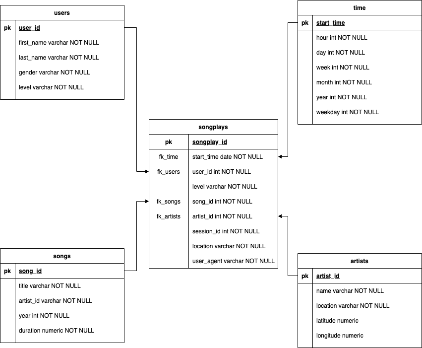

# ETL Sparkify

A startup called Sparkify wants to analyze the data they've been collecting on songs and user activity on their new music streaming app. The analytics team is particularly interested in understanding what songs users are listening to. Currently, they don't have an easy way to query their data, which resides in a directory of JSON logs on user activity on the app, as well as a directory with JSON metadata on the songs in their app.

In this project, using the song and event datasets, you can create a star schema optimized for queries on song play analysis. 

This includes the following tables.

Fact Table

    songplays - records in log data associated with song plays i.e. records with page NextSong
        songplay_id, start_time, user_id, level, song_id, artist_id, session_id, location, user_agent

Dimension Tables

    users - users in the app
        user_id, first_name, last_name, gender, level
    songs - songs in music database
        song_id, title, artist_id, year, duration
    artists - artists in music database
        artist_id, name, location, latitude, longitude
    time - timestamps of records in songplays broken down into specific units
        start_time, hour, day, week, month, year, weekday


## Files

There are two datasets for this project: song and log datasets that reside in S3. 

Here are the S3 links for each:

    Song data: s3://udacity-dend/song_data
    Log data: s3://udacity-dend/log_data

Log data json path: s3://udacity-dend/log_json_path.json


### Song Dataset

The first dataset is a subset of real data from the Million Song Dataset. Each file is in JSON format and contains metadata about a song and the artist of that song. The files are partitioned by the first three letters of each song's track ID. For example, here are filepaths to two files in this dataset.

```
song_data/A/B/C/TRABCEI128F424C983.json
song_data/A/A/B/TRAABJL12903CDCF1A.json
```

And below is an example of what a single song file, TRAABJL12903CDCF1A.json, looks like:

```
{"num_songs": 1, "artist_id": "ARJIE2Y1187B994AB7", "artist_latitude": null, "artist_longitude": null, "artist_location": "", "artist_name": "Line Renaud", "song_id": "SOUPIRU12A6D4FA1E1", "title": "Der Kleine Dompfaff", "duration": 152.92036, "year": 0}
```

### Log Dataset

The second dataset consists of log files in JSON format generated by this event simulator based on the songs in the dataset above. These simulate app activity logs from an imaginary music streaming app based on configuration settings.

The log files in the dataset are partitioned by year and month. For example, here are filepaths to two files in this dataset.

```
log_data/2018/11/2018-11-12-events.json
log_data/2018/11/2018-11-13-events.json
```

And below is an example of what the data in a log file, 2018-11-12-events.json, looks like:

```
{"artist":null,"auth":"Logged In","firstName":"Walter","gender":"M","itemInSession":0,"lastName":"Frye","length":null,"level":"free","location":"San Francisco-Oakland-Hayward, CA","method":"GET","page":"Home","registration":1540919166796.0,"sessionId":38,"song":null,"status":200,"ts":1541105830796,"userAgent":"\"Mozilla/5.0 (Macintosh; Intel Mac OS X 10_9_4) AppleWebKit/537.36 (KHTML, like Gecko) Chrome/36.0.1985.143 Safari/537.36\"","userId":"39"}
```

## Start schema



## Running the ETL pipeline

1.  Run `create_resouces.ipynb` to ensure that all resources on AWS like was ready:
    - a Redshift cluster will be created
    - iam role will bre created
    - a incoming TCP specify on DB_PORT env variable will be opened

2.  Run `create_tables.py` to create the database.

3.  Run `test.ipynb` to ensure all tables were created. Shutdown the kernel.

4.  Run `etl.py` to start the ETL data pipeline:
    - load from S3 to staging tables on Redshift
    - load from staging tables to analytics tables on Redshift
    
5. Run `test.ipynb` to check the analytic queries on your Redshift database.